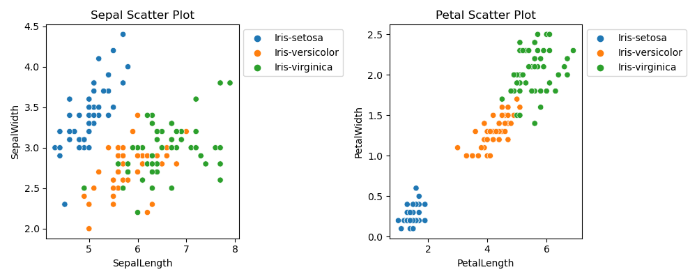

# Problem Project 2023

## Table of Contents
* [Introduction](#introduction)
* [Program](#program)
    * [Summary of Each Variable](#summary-of-each-variable)
    * [Histogram of Each Variable](#histogram-of-each-variable)
    * [Scatter Plot of Each Pair of Variable](#scatter-plot-of-each-pair-of-variable)
* [Analysis](#Analysis)
* [Refrences](#refrences)
* [Technologies](#technolgies)

## **Introduction**
The **Iris flower data set**, otherwise known as **Fishers Iris data set**, is a multivariate data set used and made famous by the British statistcian and biologist [Ronald Fisher][1] in his 1936 paper *The use of multiple measurements in taxonomic problems as an example of linear discriminant analysis*. [Multivariate statistics][2] is a branch of statistics that deals with the analysis of multiple variables at the same time. It involves studying various types of multivariate analysis and their relationships with each other. This data set has since been widely used for pattern recognition and classification tasks in various fields, including machine learning, statistics, and biology. 

Fisher's Iris data set is a well-known and widely used data set in the field of machine learning and statistics. The [data set][3] consists of 50 samples from each of three species of Iris flowers (Iris Setosa, Iris Virginicia, and Irish Versicolor). Each sample has four numerical features (sepal length, sepal width, petal length, peetal width) measured in centimeters. Two of the three species were collected in the Gaspe Peninsula "all from the same pasture, and picked on the same day and measured at the same time by the same person with the same apparatus". The goal of the analysis is to classify the iris species based on the measurements of these four features. Based on the combination of these four features, [Fisher][4] developed a linear discriminant model to distinguish the species from eachother.

Overall, Fisher's Iris data set is a well-known and valuable resource for researchers in the field of machine learning and statistics. Its simplicity and small size make it an ideal starting point for exploring classification algorithms and statistical techniques.

## **Program**
### ***Summary of Each Variable***
This program required two modules to be imported in order to carry out the analysis. These modules were *pandas* and *matplotlib.pyplot*. [Pandas][5] is a python library used for working with data sets. It helps analyze, clean, explore, and manipulate data. Pandas allows you to analyze big data and make conclusions based on statistcal theories, aswell as clean messy data sets, and make them readable. [Matplotlib][6] is a low level graph plotting library in python that serves as a visualization utility. Pandas is imported using the *pd* alias and matplotlib.pyplot is imported using the *plt* alias.

Before the summary of each variable could be found, the data must first be loaded into the program. The data set is in CSV format, therefore, *.read_csv()* is used to read in the dataset and store it as a [dataframe obeject][7] in the variable *iris_data*.

The [With Open in Python][9] allows you to work with files by opening them. The *open()* function must be used in conjunction with the *close()* function. However, the *with* statement closes the file for you without being told to. There are two parameters in the *open()* function - the filename and the mode. In this case, the mode is write. Once the data is loaded and opened in the program, it is now possible to get an overview of the values each column contains. This is done by using the *.describe()* function. The dataframe contains numerical data, thus, the [information displayed][8] for each column will be:

- count - The number of not-empty values.
- mean - The average (mean) value.
- std - The standard deviation.
- min - The minimum value.
- 25% - The 25% percentile.
- 50% - The 50% percentile.
- 75% - The 75% percentile.
- max - The maximum value.

By default, *.describe()* method returns a pandas dataframe. However, the *write()* method expects a string as an input, not a pandas dataframe. Hence, [.to_string()][10] method converts the pandas dataframe to a string format that can be written to a text file. 

- - - -

### ***Histogram of Each Variable***
The next part of the program makes a histogram of each variable and saves them to PNG files. Histograms allow seeing the distribution of the data for various columns. The *matplotlib.pyplot* module came into use in this section of the program. The program iterates over each column in the dataframe except the last one as that contains the target variable. This is done by using [slicing][11]. The target variable is categorical, not continuous, therefore it cannot be made into a histogram. 

The *hist()* function from the *matplotlib.pyplot* library creates a histogram of the current column. An arguement is passed inside this function which specifies the number of [bins][12] to use for grouping the data. In this case bins is set to 8. It was quite difficult to distingush between the different bins, therefore the [edge][15] of each histogram is set to black to make it easier to read.

The functions *xlabel()* and *ylabel()* were taken from the *matplotlip.pyplot* library to label the plot. The x label for each plot was set to the current column from the dataset, while the y label was called *Fequency*. The fonts for all the [Labels][13] were edited using the variables *font1* and *font2*. They set the style, size and colour of the font.

The *savefig()* function saves the histograms to PNG files. To ensure the files are saved to separate PNG files, the function *clf()* is used. The [clf][14] function is a pyplot module used to clear the current figure. This ensures the next figure is going onto a clear figure and is not overlapping previous data.

- - - -

### ***Scatter Plot of Each Pair of Variable***
This part of the program makes a scatter plot of each pair of variables. It shows the relationship between the sepal length and sepal width, and also between the petal length and petal width. The program begins with the comparison of the sepal length and sepal width. The program required an extra module to be imported in order to carry out the analysis. The module is *seaborn*, imported using the *sns* alias. [Seaborn][16] is a data visualization library based on matplotlib. It builds on top of matplotlib and integrates closely with pandas data structures. It provides a high-level interface for drawing attractive and informative statistical graphics, and helps explore and understand the data.

The *scatterplot()* function draws a [scatter plot][17] with the possibility of several semantic groupings. Within this function the x-axis is set to the sepal length and the y-axis is set to the sepal width. The [hue][18] was also set inside the *scatterplot()* function. Hue is the grouping varaible that will produce points with different colors. It can either be categorical or numeric. In this case, the groupings were Iris-setosa, Iris-versicolor and Iris-virginica. Finally, the data structure is input through the *data* parameter.

The legend makes the scatter plot more readable. The *bbox_to_anchor* parameter is a [box][19] that is used to position the legend in conjunction with the loc. It can be done using 2-tuple, or 4-tuble floats, in this case, the program is using 2-tuple (x,y). This type of tuple places the corner of the legend specified by loc as x,y. The loc is the location of the legend. The string *upper right* places the legend at the corresponding corner of the axis. The *show()* function then creates the scatterplot and makes it visible.

The same code is used to get the petal scatter plot. The only difference is the x-axis is set to the petal length and the y-axis is set to the petal width. Instead of two different figures popping up at different times, both scatterplots appear as subplots. This allows the two scatter plots to be seen side by side.[Figs & Axes][20] is used to make the subplots. It allows *ax[0]* and *ax[1]* to be used anywhere in the code while defining limits,labels and legends. The parameters set inside the function [subplot()][21] were the number of rows, the number of columns and the size of the figure. There was 1 row with 2 columns. The [figure size][22] was choosen through trial and error. In this case the figure is 10 inches wide and 4 inches high. The [tight_layout()][23] function automatically adjusts the sapcing between the subplots. In order to tell the two scatterplots apart, a title was given to each plot using the *title()* function.

- - - -

## **Analysis**
The summary of the data in the text file allows us to see the count of each column, average value, standard divation, minimum and maximum values. 

There are number of qualities visiable in the histograms:
- The highest frequency of the sepal length is between 30 and 35 which is between 6cm and 6.5cm.
- The highest frequency of the sepal width is between 35 and 40 which is roughly between 2.6cm and 3.25cm.
- The highest frequency of the petal length is between 45 and 50 which is between 1cm and 2cm.
- The highest frequency of the petal width is around 40 which is roughly between 0.1cm and 0.4cm.

## **Refrences**
[1]: <https://en.wikipedia.org/wiki/Ronald_Fisher>
[2]: <https://en.wikipedia.org/wiki/Multivariate_statistics>
[3]: <https://www.kaggle.com/datasets/arshid/iris-flower-dataset>
[4]: <https://en.wikipedia.org/wiki/Iris_flower_data_set>
[5]: <https://www.w3schools.com/python/pandas/pandas_intro.asp>
[6]: <https://www.w3schools.com/python/matplotlib_intro.asp>
[7]: <https://realpython.com/pandas-python-explore-dataset/#setting-up-your-environment>
[8]: <https://www.w3schools.com/python/pandas/ref_df_describe.asp>
[9]: <https://www.freecodecamp.org/news/with-open-in-python-with-statement-syntax-example/>
[10]: <https://pandas.pydata.org/pandas-docs/stable/reference/api/pandas.DataFrame.to_string.html>
[11]: <https://stackoverflow.com/questions/15535205/what-does-1-mean-do-in-python>
[12]: <https://stackoverflow.com/questions/33458566/how-to-choose-bins-in-matplotlib-histogram>
[13]: <https://www.w3schools.com/python/matplotlib_labels.asp>
[14]: <https://www.geeksforgeeks.org/matplotlib-pyplot-clf-in-python/>
[15]: <https://datagy.io/histogram-python/>
[16]: <https://seaborn.pydata.org/>
[17]: <https://seaborn.pydata.org/api.html>
[18]: <https://seaborn.pydata.org/generated/seaborn.scatterplot.html>
[19]: <https://matplotlib.org/stable/api/_as_gen/matplotlib.pyplot.legend.html>
[20]: <https://pub.towardsai.net/day-3-of-matplotlib-figure-axes-explained-in-detail-d6e98f7cd4e7>
[21]: <https://matplotlib.org/stable/api/_as_gen/matplotlib.pyplot.subplots.html>
[22]: <https://www.geeksforgeeks.org/change-figure-size-in-pandas-python/>
[23]: <https://www.geeksforgeeks.org/matplotlib-pyplot-tight_layout-in-python/>

## **Technologies**
  * Visual Studio Code - version 1.74.3
  * Cmder - version 1.3.20.151